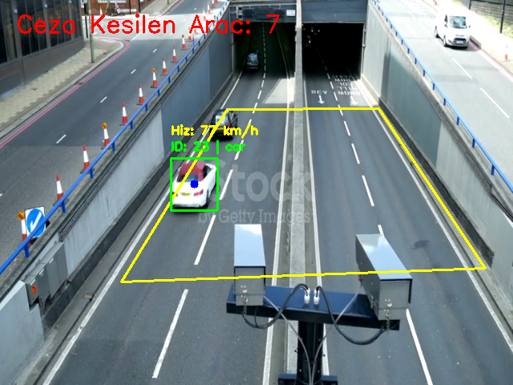

# 🚦 Autonomous Traffic Monitoring & Speed Violation Detection System

An industrial-grade, AI-powered computer vision system developed for autonomous speed estimation and traffic rule violation detection.

This project goes beyond a standard object tracking application by incorporating advanced engineering concepts such as asynchronous architecture to overcome hardware bottlenecks, optical calibration, and signal noise filtering.

## 🚀 Core Architecture & Features

- **Producer-Consumer Queue (Threaded Edge AI):** To prevent disk and CPU I/O bottlenecks, the video reading process is isolated into a separate background thread and synchronized with the main AI loop using a FIFO queue. This ensures maximum utilization of hardware resources.
- **Bird's Eye View (Homography) Calibration:** The non-linear pixel-to-meter distortion caused by the camera perspective is eliminated using a 4-point *Warp Perspective* transformation. Vehicle speeds are calculated with high accuracy on a virtual bird's-eye plane using X-Y Euclidean distance vectors.
- **Moving Average Noise Filter:** Instantaneous speed fluctuations caused by bounding box jitter are filtered out like a hardware shock absorber by taking the moving average of the last N frames.
- **Auto-Capture & ROI Extraction:** The system automatically detects vehicles exceeding a predefined speed limit (for example, 60 km/h), crops the vehicle from the original frame (Region of Interest), and logs it with ID and speed data as visual evidence.

## 🛠️ Technologies Used

- **Artificial Intelligence:** Ultralytics YOLOv8 (Nano model)
- **Computer Vision & Optics:** OpenCV (Homography, matrix manipulation)
- **Data Structures & Concurrency:** Python `threading`, `queue`
- **Mathematical Models:** `numpy`, Euclidean distance, vector-based speed estimation

## 📸 System Outputs

*Real-time object tracking, homography polygon, and speed estimation:*



## 💻 Installation & Execution

1. Clone the repository:

   ```bash
   git clone https://github.com/Furkan179/traffic-analytics.git
   cd traffic-analytics
   ```

2. Create a virtual environment and install dependencies:

   ```bash
   python3 -m venv baykar_env
   source baykar_env/bin/activate
   pip install -r requirements.txt
   ```

3. Run the calibration script (optional, to define specific road coordinates):

   ```bash
   python kalibrasyon.py
   ```

4. Start the main analysis system:

   ```bash
   python 01_video_reader.py
   ```